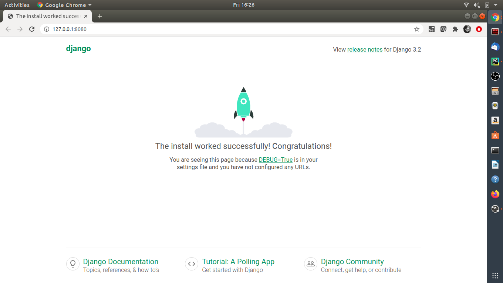

# bftp-django

## Install python3

`sudo apt install python3`

## Install python3-pip

`sudo apt install python3-pip`

## Install django

`pip3 install django`

## Verify django-admin is installed

`django-admin --version`

## View list of subcommand available with django-admin
`django-admin help --commands`

## Kickstart vanilla project with subcommand startproject
`django-admin startproject firstapp`
 
## Change directory to firstapp and edit file settings.py with IP application will run on
`ALLOWED_HOSTS = ['127.0.0.1']`

## Migrate the changes [ Need to be run only when you start project ]
`python3 manage.py migrate`

## Start your application on IP:PORT [ Make sure PORT is open and not in use at IP mentioned ]
`python3 manage.py runserver 127.0.0.1:8080`

## Expected Output
`$ python3 manage.py runserver 127.0.0.1:8080
Watching for file changes with StatReloader
Performing system checks...

System check identified no issues (0 silenced).
October 08, 2021 - 10:54:34
Django version 3.2.8, using settings 'firstapp.settings'
Starting development server at http://127.0.0.1:8080/
Quit the server with CONTROL-C.`

## Verify your application is launched by running following in browser
[127.0.0.1/8080](127.0.0.1/8080)

## Expected log when application is accessed via browser
`[08/Oct/2021 10:56:32] "GET / HTTP/1.1" 200 10697`

## Expected View

